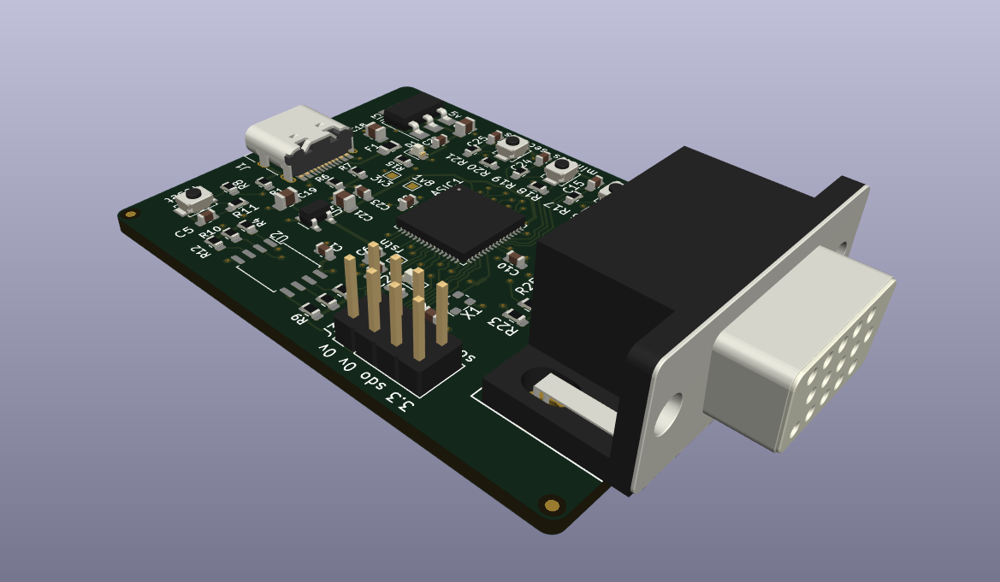

Matt Venn's ASIC VGA Clock
==========================

* World's first [certified open source hardware](https://certification.oshwa.org/es000023.html) down to the GDS?
* The original design was using an ASIC that was part of the Google sponsored MPW1. Due to [many issues with this first chip](https://www.zerotoasiccourse.com/post/mpw1_silicon/), the current version uses one from the [TinyTapeout 3p5](https://github.com/TinyTapeout/tinytapeout-03p5) experimental test.
* For more details about the design, see [VGA ASIC Clock](https://www.zerotoasiccourse.com/post/vga_clock/). 

# PCB

This PCB started by forking the https://github.com/TinyTapeout/caravel-mvp-pcb template repository. That provides all the minimal necessary components for the chip to work. 
This repo then adds the needed buttons and VGA connector for the clock design.

* [PDF Schematic](doc/schematic.pdf)

# Setup

## Firmware

This needs to be made public and the fw fixed to always select clock.

https://github.com/TinyTapeout/tt3p5-demo-fw/

## PLL config

Needs 31.5MHz for VGA signal. As precise as possible for good timekeeping.
A 9MHz oscillator should also work if using the chip's built in PLL.

Using https://github.com/kbeckmann/caravel-pll-calculator

    matt-desktop:2003 [main]: ./caravel_pll.py generate --clkout 31.5 --clkin 9
    PLL Parameters:

    clkin:    9.00 MHz
    clkout:   31.50 MHz
    clkout90: 31.50 MHz

    PLL Feedback Divider: 14
    PLL Output Divider 1: 4
    PLL Output Divider 2: 4

    Register 0x11: 0x24
    Register 0x12: 0x0e

## Pinning

The chip's pinout is here: https://github.com/TinyTapeout/tinytapeout-03p5/blob/main/verilog/rtl/user_defines.v

The definition of the clock design pins are here: https://github.com/TinyTapeout/tt03p5-vga-clock/blob/main/src/tt_vga_clock.v

### inputs

06 clock 
07 rst_n
08 hours
09 mins
10 sec

### outputs

16 hsync
17 vsync
18:23 rrggbb

# BOM

TBD

# Errata

# Resources

* Caravel datasheet: https://caravel-harness.readthedocs.io/en/latest
* Version 1 repository is here: https://github.com/mattvenn/vga_clock_pcb

# License

* The ASIC and PCB are licensed under the [Apache2 License](LICENSE)

# Open Source Hardware

This board is an OSHWA approved design: [ES000023](https://certification.oshwa.org/es000023.html)

